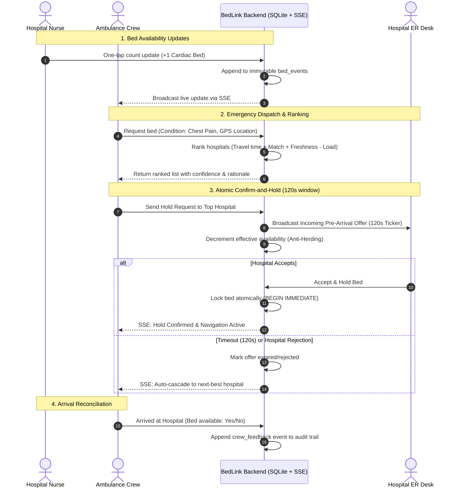

# BedLink

# TECHFORGE 2026 — FINAL SUBMISSION

## 1. Team Details
- **Team Name**: Bro-Code
- **Team Members**:
  - Harsh Tari
  - Aman Mandal
  - Yash Dhekale
  - Aaditya Devghare

## 2. Problem Statement
- **Problem Statement Name**: Real-Time Emergency Bed Allocation and Intelligent Ambulance Dispatch System
- **Selected Domain**: HealthTech
- **Description**: An ambulance crew with a critical patient needs the nearest hospital that has the right bed (ICU, ventilator, oxygen, or a specialty such as cardiac or burns) right now. BedLink delivers three connected modules: a 10-second bed-update screen for hospital nurses (one tap per bed type, works on basic mobile phones); an ambulance dispatch screen that matches patient requirements with hospital capabilities and ranks facilities by bed match, travel time, data freshness, and current load; and a confirm-and-hold workflow where the chosen hospital accepts or rejects within 2 minutes, reserving the bed while automatically cascading to the next-best facility upon timeout or rejection.

## 3. Project Details
- **Project Title**: BedLink
- **Short Description**: BedLink is a real-time emergency decision-support platform connecting ambulance crews with hospitals to identify the nearest facility with verified bed availability (ICU, Ventilator, Oxygen, Cardiac, Burns). It pairs a 10-second one-tap mobile update interface for nursing staff with an intelligent multi-factor ambulance dispatch ranking engine factoring in bed match, travel time, data freshness, and hospital load. A 2-minute atomic confirm-and-hold protocol reserves the bed before the ambulance arrives, automatically cascading to the next-best hospital upon rejection or timeout to prevent critical emergency delays.

## 4. GitHub Repository
- **GitHub Repository Link**: [https://github.com/Yash662007/T43-Brocode-Bedlink](https://github.com/Yash662007/T43-Brocode-Bedlink)

---

## Project Overview

Emergency medical transit often faces the critical "golden hour" dilemma: ambulances arrive at the nearest hospital only to find specialized beds (ICU, ventilators, burns units) full, leading to catastrophic inter-hospital transfers.

**BedLink** resolves this through real-time coordination and decision support:
- **Decision support, not a blind guarantee**: Transparently displays data freshness (minutes since last update), confidence ratings (`Likely free`, `Uncertain`, `Probably full`, `Unknown`), and plain-language reasoning for every recommendation.
- **Three synchronized roles**:
  1. **Hospital Nurse**: 10-second bed stepper screen to update counts on basic mobile devices without complex logins.
  2. **Ambulance Crew**: Dispatch interface that filters by clinical condition, ranks hospitals dynamically, and initiates bed holds.
  3. **Hospital Emergency Desk**: Pre-arrival heads-up display with a 2-minute countdown timer to accept and reserve beds before arrival.

---

## Setup & Installation Instructions

### Prerequisites
- **Node.js** (v18.0.0 or higher)
- **npm** (v9.0.0 or higher)

### Quick Start (4 Commands)

```sh
# 1. Install frontend dependencies
npm install

# 2. Install backend dependencies
npm run server:install

# 3. Configure backend environment
cp server/.env.example server/.env

# 4. Seed the database with demo hospitals & tokens
npm run server:seed
```

> **Note**: The root `.env` is pre-configured with required frontend variables. Do not overwrite it with `.env.example`.

### Running the Application

To launch both backend and frontend concurrently:

```sh
npm run demo
```

- **Backend**: Runs on `http://localhost:4000`
- **Frontend**: Runs on `http://localhost:8080`

Open `http://localhost:8080` in your browser and use the **View workspace** selector (or query params `?screen=nurse`, `?screen=hospital`, `?screen=ambulance`) to preview each role.

### Running Individual Services

```sh
# Run backend only (development mode with hot-reload)
npm run server:dev

# Run frontend only
npm run dev

# Run simulated live telemetry feed
npm run simulate

# Run Telegram bot (requires TELEGRAM_BOT_TOKEN in server/.env)
npm run server:bot
```

### Running Tests

```sh
# Run backend concurrency, hold/offer state machine, and anti-herding tests
npm run server:test

# Run frontend unit tests
npm test
```

---

## Key Features

- **10-Second Bed Updates for Nurses**:
  - One-tap (+ / -) counters for ICU, Ventilator, Oxygen, Cardiac, and Burns beds.
  - Zero-latency UI designed to function reliably on low-cost smartphones and slow cellular connections.
  - Optional AI note review: Extracts structured bed count updates from free-form nursing shift notes via OpenAI API.
  - Telegram Bot integration (`/shiftchange`, `/specialist`, quick-tap counts) for staff who prefer messaging apps.
- **Intelligent Dispatch & Ranking Engine**:
  - Scores and ranks facilities using: `Travel Time + (1 - pAvailable) * Fallback Penalty + Load Penalty`.
  - Capability gating: Ensures hospitals have both physical infrastructure (e.g., Catheterization Lab for STEMI) and verified on-call specialists.
  - Anti-herding protection: Dynamically deducts active holds from effective availability to prevent routing multiple ambulances to the same last bed.
- **Atomic 2-Minute Confirm-and-Hold Protocol**:
  - Pre-arrival alert sent directly to hospital ER desk.
  - Server-driven 120-second countdown ticker.
  - SQLite `BEGIN IMMEDIATE` transactions prevent race conditions; concurrent claims on the last bed guarantee exactly one winner.
  - Automatic cascade: If the hospital rejects or the timer expires, the offer immediately transitions to the next-ranked hospital.
- **Data Freshness Decay & Auditability**:
  - Shows explicit elapsed time (e.g., *"Updated 4m ago"*). Counts older than threshold (e.g., 60 min for ICU) decay to `Unknown` confidence.
  - Immutable, append-only event log capturing every change source (`nurse_tap`, `telegram`, `crew_feedback`, `sim_feed`, `restore`).
- **Post-Arrival Feedback Loop**:
  - Crew confirms bed availability upon hospital arrival with one tap, immediately validating or correcting reported counts.

---

## Technology Stack

- **Frontend**:
  - **Framework**: React 19, TanStack Start, TanStack Router
  - **Styling**: Tailwind CSS, Lucide React icons
  - **Build Tool**: Vite
  - **Data Fetching**: Native Fetch API + Server-Sent Events (SSE)
- **Backend**:
  - **Runtime**: Node.js & TypeScript
  - **Server Framework**: Express.js
  - **Database**: SQLite via `better-sqlite3` (ACID transactions, sub-millisecond local queries)
  - **Real-Time Layer**: Server-Sent Events (SSE) for low-overhead client push
- **External Integrations & Libraries**:
  - **Telegram Bot**: grammY framework
  - **AI Parsing**: OpenAI API (structured note extraction)
  - **Geodata**: OpenStreetMap Overpass API integration for hospital coordinates

---

## Architecture / Workflow



---

## Dataset & API Information

### Seeded Hospital Dataset
BedLink includes a deterministic seed dataset modeling 6 hospitals across Mumbai with realistic capability profiles:
- **City General Hospital**: Public Tertiary Care (ICU, Ventilator, Oxygen, Cardiac, Burns, Cath Lab).
- **Apex Trauma Center**: Level-1 Trauma & Surgical ICU specialist.
- **Metro Heart Institute**: Dedicated Cardiology & Interventional Cath Lab.
- **St. Jude Community Hospital**: Secondary facility with general medical/oxygen beds.
- **Suburban Emergency Clinic**: Rapid triage facility with emergency stabilization.
- **Highland Super Specialty**: Private tertiary care with comprehensive specialist on-call coverage.

Real hospital geodata can also be imported via OpenStreetMap:
```sh
IMPORT_BBOX="18.90,72.75,19.25,73.05" npm run import-hospitals
```

### Core REST & Streaming APIs
| Method | Endpoint | Description |
|---|---|---|
| `GET` | `/api/beds` | Retrieve current confirmed and effective bed counts per hospital |
| `POST` | `/api/events` | Log an append-only bed update event (`nurse_tap`, `telegram`, etc.) |
| `POST` | `/api/dispatch/rank` | Multi-factor hospital ranking based on patient condition and GPS coordinates |
| `POST` | `/api/requests` | Initiate a dispatch request for a patient |
| `POST` | `/api/offers/:id/accept` | Atomically accept and place a 2-minute hold on a hospital bed |
| `POST` | `/api/offers/:id/reject` | Reject bed offer, triggering immediate auto-cascade to next facility |
| `GET` | `/api/specialists` | Check active on-call specialist status |
| `GET` | `/api/stream` | Server-Sent Events stream for real-time bed changes, offers, holds, and timer ticks |

---

## Screenshots & Demo Information

Refer to [DEMO.md](DEMO.md) for the complete 3-minute evaluation walkthrough.

### Demo Run Guide (Three-Window Setup)
Open three parallel browser windows pointing to `http://localhost:8080`:
1. **Window A (`?screen=nurse`) — Ground Truth Bed Management**:
   - Displays real-time bed counters for City General Hospital.
   - Tap **+** on Cardiac beds and click **Everything is correct**.
   - Check **Update history** to inspect the immutable audit log with timestamp and nurse attribution.
2. **Window B (`?screen=ambulance`) — Ambulance Dispatch**:
   - Select patient clinical condition (e.g., **Chest Pain** requiring a Cardiac bed).
   - Review ranked hospitals: inspect the top recommendation, travel time, confidence badge, and plain-language reasoning.
   - Tap **Send bed request**.
3. **Window C (`?screen=hospital`) — Hospital ER Desk Pre-Arrival**:
   - The pre-arrival alert rings immediately via SSE with patient condition and live countdown timer.
   - Click **Accept and hold bed**.
   - Window B automatically transitions to **Confirmed** with zero polling, and Window A reflects the reserved bed hold.

---

## Limitations & Future Scope

### Limitations
- **Manual Data Dependency**: Relies on hospital staff to tap updates or send messages; if unmaintained, data freshness degrades to "Unknown".
- **Simplified Travel Estimation**: Current demo calculates estimated travel times via haversine distance and calibrated velocity assumptions rather than dynamic traffic APIs.
- **Clinical Protocol Generalization**: Condition-to-bed capability mappings are representative and require formal validation by regional emergency medical authorities.

### Future Scope
- **National Health Stack (ABDM / HMIS) Integration**: Direct integration with government hospital management systems for automatic HL7/FHIR bed telemetry ingestion.
- **Dynamic Traffic Routing**: Integration with Mapbox/Google Maps Matrix APIs for real-time congestion-aware ambulance navigation.
- **Automated IoT Sensor Feeds**: Interfacing with smart ICU bed sensors and ventilator telemetry to eliminate manual nursing inputs entirely.
- **Voice & Multilingual Input**: Voice-driven bed updates via local language speech-to-text for nursing staff on the move.

---

## Team Members

- **Harsh Tari**
- **Aman Mandal**
- **Yash Dhekale**
- **Aaditya Devghare**
